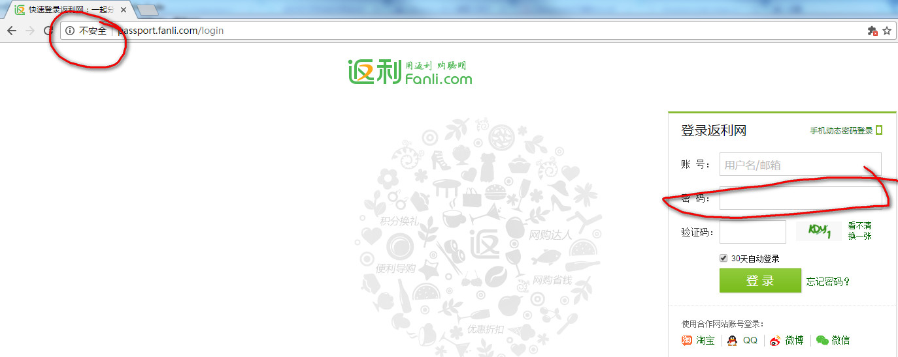

> 从2017年1月份正式发布的Chrome 56开始，Google将把某些包含敏感内容的HTTP页面标记为“不安全”，比如含有密码或支付表单信息。

### 参考链接
1. http://www.cnbeta.com/articles/soft/537513.htm
2. https://www.oschina.net/news/70324/google-chrome-moves-toward-full-https

